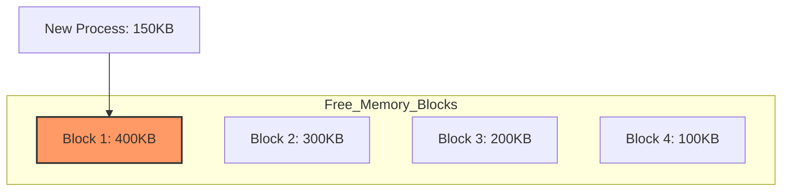
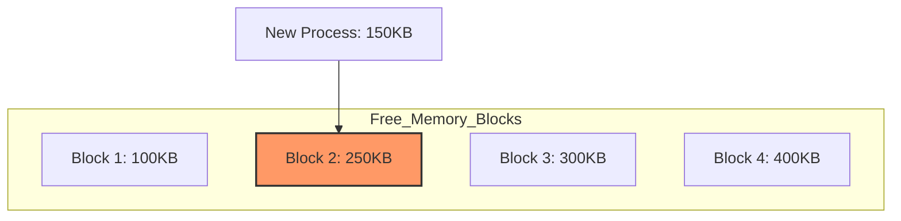
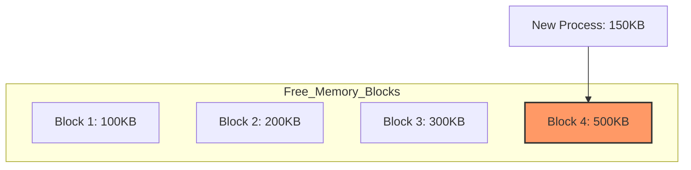

# Continuous Memory Allocation
Continuous memory allocation assigns a process to a contiguous block of memory, ensuring that all memory addresses used by the process are sequential. This method is simple to implement but can lead to inefficient memory use due to fragmentation. Common strategies for this allocation include first-fit, best-fit, and worst-fit approaches. To manage fragmentation, compaction may be required to consolidate free memory spaces.

## Swapping
Removed processes are not currently using from memory, and move them to secondary storage. And then, load new process into new empty space.

### Advantage
If required memory space from several processes is higher than actual memory size, we can execute several processes at the same time.

## Concept of Continuous Memory Allocation
Process need to be allocated in empty space of memory. There are few ways to implement it.

**First-Fit** allocation searches for the first block of free memory that is large enough to accommodate the process. Once found, the process is allocated to this block, even if it leaves some unused space. This method is fast and simple but can lead to fragmentation as small gaps may be left between allocated memory blocks. Over time, these gaps can accumulate, making it harder to find suitable blocks for new processes.

---

**Best-Fit** allocation searches the entire list of free memory blocks to find the smallest block that is large enough to accommodate the process. This approach aims to minimize wasted space by selecting the block that leaves the least amount of unused memory. While it can reduce fragmentation initially, it is slower due to the need to search the entire list, and small gaps may still accumulate over time. These small gaps can become problematic if not managed properly, as they may be too small for future allocations.

---

**Worst-Fit** allocation searches for the largest available block of memory to allocate to the process. The idea is to leave larger remaining blocks, reducing fragmentation by avoiding the creation of small unusable gaps. This method can lead to better utilization of memory over time but may waste large blocks on smaller processes, leaving fewer large blocks available for future needs. The search for the largest block can also make this method slower compared to first-fit.

# External Fragmentation
Continuous memory allocation is not an efficient way to utilize memory. It has potential problem to occur external fragmentation.

## Solution of External Fragmentation

**Memory compaction** is a process used by the operating system to consolidate free memory space by relocating allocated memory blocks, thereby reducing fragmentation. This technique ensures that all free memory is contiguous, making it easier to allocate large blocks of memory to new processes.

**Paging** is the most effective and popular way to solve external fragmentation. To implement this, virtual memory is required.
